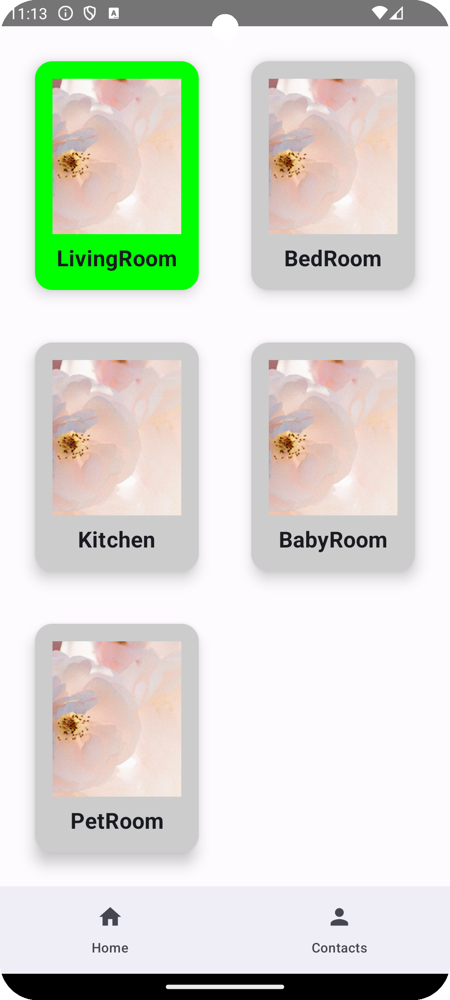

# 概要
SkyWay SFURoom APIとP2PRoom APIを試すアプリとなります

# 機能
## 部屋のonline状況チェック
family-serverと連動しているため、先にfamily-serverの方に、Room配信を開始する必要があります。

| online部屋がない場合 | LivingRoomがonlineの場合 | LivingRoom&BabyRoomがonlineの場合 |
| -- | --| --|
|  |  | 

## 配信部屋
online状態(緑背景が表示される部屋)をクリックすると、入室可能です。(offline状態の部屋だと入室不可)

画面の上部は部屋の実況(family-serverより配信)となり、下は入室のメンバーリストになります
| 自分以外の入室メンバーがない時 | 自分以外入室メンバーがある時 |
| -- | -- |
|  |  |

メンバーをクリックするとメンバーとのP2P通話画面が開きます

## P2P通話画面

